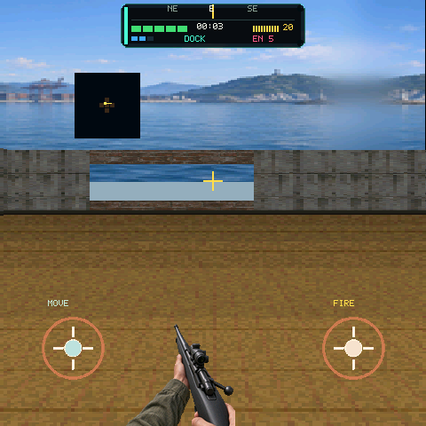

# Last Zone: Extraction

A compact battle-royale-inspired training-ground game for the ESP-Mosaico Game
SDK. Fight through five tactical drills, scavenge supplies, clear the last
hostile, and reach the extraction pad. The native C Host preview and the
device share the same fixed-step model and RGB565 view.

轻量训练场射击 Demo。五关战术关卡、搜刮补给、清掉最后一名敌人后走到撤离点。Host RGB565 预览与真机共用同一套固定步长模型和画面。



The screenshot is a Host RGB565 frame of the Dock mission.

截图为 Dock 关卡的 Host RGB565 画面。

## Play / 玩法

- Tap the briefing to deploy or redeploy. / 点击简报部署或重新部署。
- Left stick moves. Push the outer ring forward to sprint. / 左摇杆移动，外环前推冲刺。
- Right drag looks and pitches. / 右侧拖动转向和俯仰。
- Tap fire (Host `F` / Ctrl) to shoot or open a facing gate. Hold fire to
  steady the bolt. / 点射击开火或打开面前的门；按住射击稳住枪机。
- Drag the radar to park it. / 拖动雷达面板挪开视线。
- Host keys: `A/D` turn, `W`/`S` walk, `Shift` sprint, `Q`/`E` strafe.

Dock teaches windows, cover, the gold gate, and extract. Later missions cut
spare ammo and add elites. Clear every hostile, then follow the extract arrow
onto the pad.

Dock 是教学关；之后弹药更紧、会出精英。清完敌人后沿箭头走上撤离点。

## Campaign / 战役

| Mission | Role | Hostiles |
| --- | --- | --- |
| Dock | observe / 观察 | 5 standard |
| Depot | control / 控制 | 7 standard |
| Command | flank / 侧翼 | 8 including 2 elites |
| Ghost | ambush / 伏击 | 8 standard |
| Run | assault / 突击 | 9 including 3 elites |

Starting ammo is 20 / 18 / 17 / 17 / 16; starting armor is 2 / 2 / 1 / 1 / 0.
Each mission has its own 360-degree horizon. Device NVS keeps campaign
progress and per-mission bests.

每关有独立的 360° 天际线。设备 NVS 保存战役进度和每关最好成绩。

## Run / 运行

```bash
# Host 仿真：在本仓库根目录
python3 tools/game_cli.py sim examples/last_zone_extraction
python3 tools/game_cli.py sim examples/last_zone_extraction --headless --frames 90

# 真机：普通 ESP-IDF 工程，不经过 ESP-Iris
export MOSAICO_BSP_COMPONENT_DIR=/path/to/esp-mosaico-bsp/components/esp-mosaico-bsp
idf.py -C examples/last_zone_extraction set-target esp32s31 build flash monitor
```
