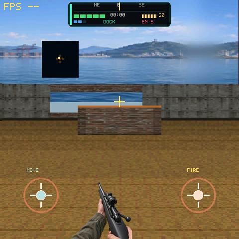

# Last Zone: Extraction

A compact battle-royale-inspired training-ground game for the ESP-Mosaico Game
SDK. Fight through five tactical drills, scavenge supplies, clear the last
hostile, and reach the extraction pad. The native C Host preview and the
device share the same fixed-step model and RGB565 view.

轻量训练场射击 Demo。五关战术关卡、搜刮补给、清掉最后一名敌人后走到撤离点。Host RGB565 预览与真机共用同一套固定步长模型和画面。



The screenshot is a Host RGB565 frame of the Dock mission.

截图为 Dock 关卡的 Host RGB565 画面。

墙体、纹理布局与性能验收见
[可复用设计方法](../../docs/reference-designs.CN.md)，其中也定义原生声音与震动事件的职责。

## Play / 玩法

- Tap the briefing to deploy or redeploy. / 点击简报部署或重新部署。
- Left stick moves. Push the outer ring forward to sprint. / 左摇杆移动，外环前推冲刺。
- Right drag looks and pitches. / 右侧拖动转向和俯仰。
- Tap fire (Host `F` / Ctrl) to shoot or open a facing gate. Hold fire to
  steady the bolt. / 点射击开火或打开面前的门；按住射击稳住枪机。
- Drag the radar to park it. / 拖动雷达面板挪开视线。
- Host keys: `A/D` turn, `W`/`S` walk, `Shift` sprint, `Q`/`E` strafe.

Dock teaches windows, cover, the gold gate, and extract. Later missions cut
spare ammo and add elites. Clear every hostile, then follow the extract arrow
onto the pad.

Dock 是教学关；之后弹药更紧、会出精英。清完敌人后沿箭头走上撤离点。

## Campaign / 战役

| Mission | Role | Hostiles |
| --- | --- | --- |
| Dock | observe / 观察 | 5 standard |
| Depot | control / 控制 | 7 standard |
| Command | flank / 侧翼 | 8 including 2 elites |
| Ghost | ambush / 伏击 | 8 standard |
| Run | assault / 突击 | 9 including 3 elites |

Starting ammo is 20 / 18 / 17 / 17 / 16; starting armor is 2 / 2 / 1 / 1 / 0.
Each mission has its own 360-degree horizon. Device NVS keeps campaign
progress and per-mission bests.

每关有独立的 360° 天际线。设备 NVS 保存战役进度和每关最好成绩。

## Heightfield upgrade / 高度场升级

Dock now starts with a three-step stair (`7`, `8`, and `9` map cells) leading
through the former window wall onto a raised loading platform. These values are
walkable floor levels at 0.10, 0.20, and 0.30 wall-height units.

Dock 出生区现在有三级楼梯，地图格 `7`、`8`、`9` 分别表示 0.10、0.20、
0.30 个墙高单位的可通行地板。楼梯穿过原来的窗墙，连接到抬高的装卸平台。

The renderer resolves the nearest valid floor-plane intersection for every
four-pixel screen column and draws every crossed height boundary as a vertical
riser. The camera, full walls, enemies, and props use the floor height of their
current cell. Movement can climb one level at a time; a two-level or higher
vertical edge remains solid. The existing low-cover cell is retained as a
separate height primitive.

渲染器会为每个 4 像素屏幕列求最近的有效地板平面交点，并把射线经过的每个高度
边界画成台阶立面。相机、整墙、敌人与道具都使用所在格的地板高度。移动一次只能
上一级，直接跨越两级以上的边缘会被挡住；原有半高掩体仍作为另一种高度图元保留。

Current scope is connected height regions: stairs, platforms, roof-like areas,
and pits. Per-cell ceiling heights, lifts, and rising doors are the next stage.
Overlapping rooms at the same x/y position require a different portal-sector
representation and are outside this grid-height format.

当前范围是互相连通的高低区域，包括楼梯、平台、屋顶式区域和坑道。下一阶段是
每格天花板高度、升降台和上升门。同一 x/y 位置上下重叠的房间需要另一套门户扇区
表示，不属于当前格子高度格式。

## Run / 运行

```bash
# Host 仿真：本仓库根目录，主机 C 编译器 + Pillow
python3 tools/game_cli.py sim examples/last_zone_extraction
python3 tools/game_cli.py sim examples/last_zone_extraction --headless --frames 90
```

本目录可作为 ESP-IDF native 工程构建；直接烧录会替换当前启动器固件。
