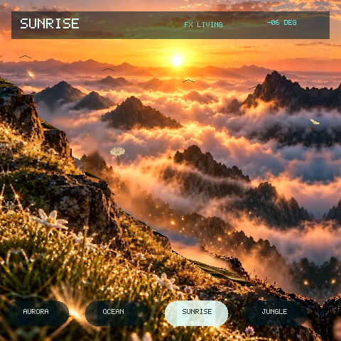

# Living Worlds

A 360-degree living-world viewer for ESP-Mosaico. Drag to look around four
scenes — Aurora, Ocean, Sunrise, and Jungle — then idle three seconds to resume
the automatic tour. The Host RGB565 preview and the device compile the same
world and view sources.

四场景 360° 环视 Demo。拖动环视极光、深海、日出和丛林；静止约三秒后自动巡游恢复。Host RGB565 预览与真机编译同一套世界与画面源码。



The screenshot above is a live device capture of the Sunrise scene.

上图为 Sunrise 场景的真机截图。

## Play / 玩法

- Horizontal drag turns through the full panorama. / 水平拖动完成 360° 转向。
- Vertical drag looks toward the sky or the ground. / 垂直拖动仰视或俯视。
- Bottom buttons switch Aurora / Ocean / Sunrise / Jungle. / 底部按钮切换极光 / 深海 / 日出 / 丛林。
- The top FX chip cycles living / mid / low effects. / 顶部 FX 芯片在 Living / Mid / Low 效果档之间切换。

The example builds a deterministic 2.5D RGB565 scene: perspective ground bands,
volume meshes, and light. It does not depend on OpenGL, Camera3D, shaders, or a
project-specific PC host.

场景用确定性 2.5D RGB565 路径绘制体积网格与光照，不依赖 OpenGL、Camera3D、shader 或项目私有 PC Host。

## Run / 运行

```bash
# Host 仿真：在本仓库根目录
python3 tools/game_cli.py sim examples/living_worlds
python3 tools/game_cli.py sim examples/living_worlds --headless --frames 300

# 真机：在 ESP-Mosaico Vibe 仓库根目录
python mosaico.py game build --project submodule/raylib-lite-engine/examples/living_worlds
python mosaico.py recover   # blank or unverified devices first
python mosaico.py iris system-update --project submodule/raylib-lite-engine/examples/living_worlds
python mosaico.py iris logs
```

Use `iris system-update` for the first install or layout/resource changes;
`iris app-update` only when the full partition table is unchanged.

首次安装或布局/资源变化用 `iris system-update`；分区表完全一致且只改代码时可用 `iris app-update`。

## Device performance baseline / 真机基线

ESP-Mosaico ESP32-S31, 480×480, default `FX LIVING`, 30 Hz logic target.

| Scene | Display rate | Render time |
| --- | ---: | ---: |
| Aurora | 22.8–22.9 FPS | 39.0–42.8 ms |
| Ocean | 13.6–14.0 FPS | 69.4–71.4 ms |
| Sunrise | 17.0–17.5 FPS | 58.1–60.3 ms |
| Jungle | 30.0 FPS | 23.6–23.9 ms |
