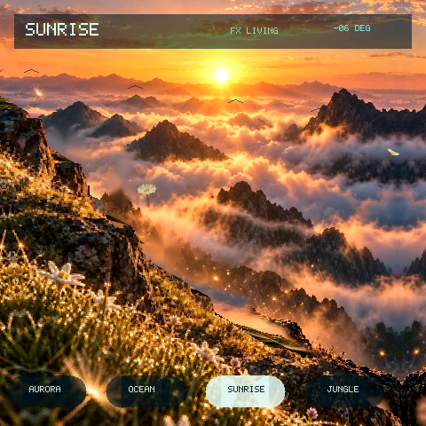

# Living Worlds

A 360-degree living-world viewer for ESP-Mosaico. Drag to look around four
scenes — Aurora, Ocean, Sunrise, and Jungle — then idle three seconds to resume
the automatic tour. The Host RGB565 preview and the device compile the same
world and view sources.

四场景 360° 环视 Demo。拖动环视极光、深海、日出和丛林；静止约三秒后自动巡游恢复。Host RGB565 预览与真机编译同一套世界与画面源码。



The screenshot above is a live device capture of the Sunrise scene.

上图为 Sunrise 场景的真机截图。

## Play / 玩法

- Horizontal drag turns through the full panorama. / 水平拖动完成 360° 转向。
- Vertical drag looks toward the sky or the ground. / 垂直拖动仰视或俯视。
- Bottom buttons switch Aurora / Ocean / Sunrise / Jungle. / 底部按钮切换极光 / 深海 / 日出 / 丛林。
- The top FX chip cycles living / mid / low effects. / 顶部 FX 芯片在 Living / Mid / Low 效果档之间切换。

The example builds a deterministic 2.5D RGB565 scene: perspective ground bands,
volume meshes, and light. It does not depend on OpenGL, Camera3D, shaders, or a
project-specific PC host.

场景用确定性 2.5D RGB565 路径绘制体积网格与光照，不依赖 OpenGL、Camera3D、shader 或项目私有 PC Host。

## Run / 运行

```bash
# Host 仿真：本仓库根目录，主机 C 编译器 + Pillow
python3 tools/game_cli.py sim examples/living_worlds
python3 tools/game_cli.py sim examples/living_worlds --headless --frames 300
```

本目录也是独立 ESP-IDF native 工程。`main/idf_component.yml` 只声明版本化 Engine 依赖，Application CMake 选择通用 Board component；Living Worlds 的 device-only JPEG adapter 隔离在 `main/native/`，仍属于 Game `main` component，且不依赖具体 Board API。仓库内通过 `override_path` 联调 Engine；ESP-Mosaico Board 自动获取固定 Git revision 的 BSP、ESP-Iris 和 Recovery 依赖，无需手动 export。设备安装与更新由 `esp-mosaico-vibe` 的 Recovery-first 流程维护，Host 仿真不需要板级依赖。

该工程只构建游戏应用，不生成 factory Recovery 固件。设备部署需先由 Vibe 工具配置或更新 Recovery，再通过 USB 安装游戏到 `ota_0`；具体操作见下方 Board 指南。
当前支持 Host 和 native ESP-IDF 固件，不支持 ELF 游戏构建、打包或加载。
历史测量见[历史真机记录](HISTORICAL_PERFORMANCE.md)和[性能实验日志](PERFORMANCE.md)；它们不是当前版本的性能验收值。

## ESP-Mosaico native dependencies / 真机构建依赖

Standard ESP-Mosaico native Game builds automatically download pinned Git dependencies:

```sh
idf.py -C examples/living_worlds -B /tmp/living-worlds-native -DIDF_TARGET=esp32s31 build
```

No BSP or utilities environment exports are required. The selected Board fetches BSP, ESP-Iris, and the upstream Recovery component at fixed revisions. See [`examples/boards/esp-mosaico`](../boards/esp-mosaico/README.md) for the Board contract and Recovery-first device workflow.
