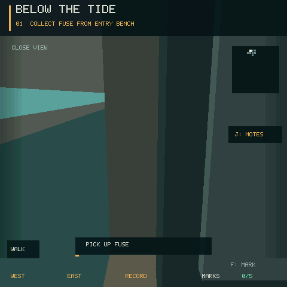
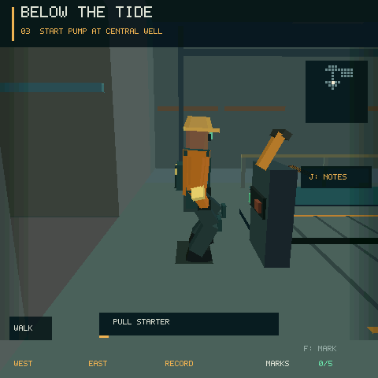
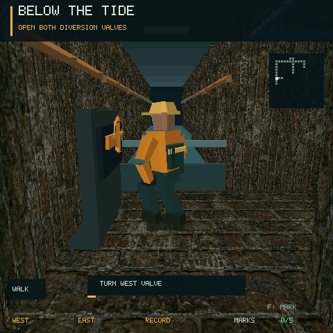
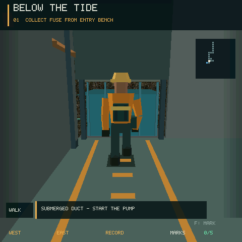
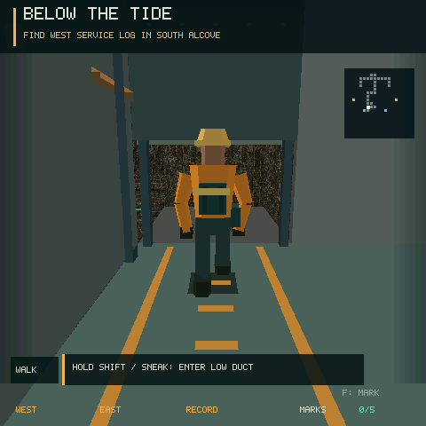
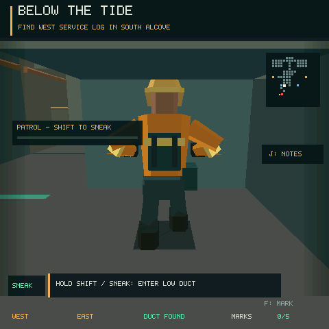
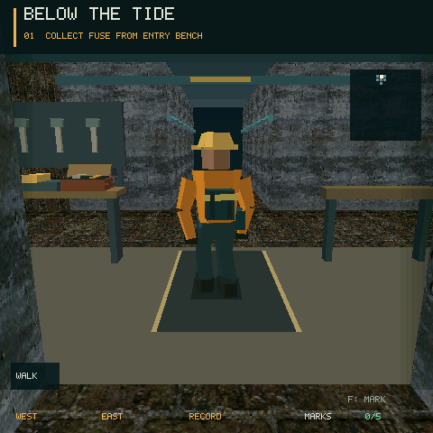
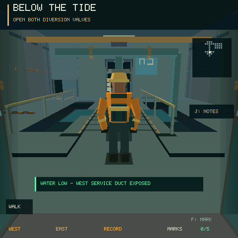
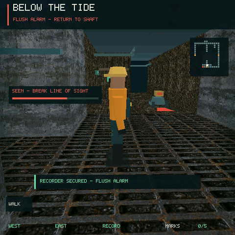

# Below the Tide / 潮线以下

An independent third-person sewer exploration prototype for Host simulation,
native ESP firmware, and the lobby ELF SDK. The layout uses four connected loops
instead of a single linear corridor. A low-polygon maintenance worker uses an
orbiting follow camera that retracts near walls. The character and camera are
adapted from the repository's original `tomb_raycast` implementation; no
commercial game assets are used. This project does not share gameplay code with
`vertical_dock`.

The entrance is a small maintenance room rather than a spawn corridor. The
near-field presentation includes draining sumps, irregular floor puddles,
narrow edge shading, compact prompts, pipe runs, and
equipment cabinets. The camera retracts immediately before a wall and eases
back to its normal distance after the obstruction clears.

独立的第三人称下水道迷宫探索原型。短款工装维修员使用贴墙自动拉近的跟随镜头。
人物使用安全帽、护目镜、手套、护膝、靴子与工具袋；走路时抬脚、屈膝、摆臂，转弯时头部先朝向目标。
场景以四条可互通的环路组织，近景重点是狭窄维护通道、积水支线、闸门、泵井与操作台。

## Motion and room details / 动作与近景

`main/sewer_pose.h` computes a compact procedural pose with fixed-length arms
and legs. The walking cycle separates the planted foot from the lifted foot;
stop and crouch transitions blend into a resting stance. Interaction poses use
the same world anchors as the equipment: pickup bends and brings the item to
the belt, valve operation has two pulls with a regrip, and the pump lever moves
with both hands. Brief approach/return steps align the rendered worker with a
collision-checked work position. Gameplay coordinates remain at the interaction
origin, and all actions still commit after 36 ticks. Move closer if the approach
would exceed 0.65 m or intersect furniture.

入口检修室有工作台、打开的工具箱、工具挂板、维修便笺、挂起的工装、应急灯和防滑垫。
中央泵井有粗管、法兰、供电/运行指示灯、同步启动杆和随水位变化的机械浮标。
工作台、柜体和启动台有移动与镜头碰撞，桌面小物件只在近处生成。
管道振动使用单个小幅位移，不进行刚体模拟。

Actual Host captures (not concept art):







Regenerate the clips while the interactive simulator is stopped:

```sh
python3 examples/sewer_labyrinth/scenarios/render_motion.py
```

The model test checks limb lengths, planted-foot height, handle contact,
furniture clearance, and 1,872 combinations of facility, room, camera heading, and pitch.
These geometry checks do not establish device FPS.

## Pump Hall 02 / 退水后的检修近路

中央泵房使用 4.6 米高的机械大厅、赭黄色吊梁、双色设备分区、02 号墙面标识和桥面标线。
泵房及检修凹室以大面积素色墙面和地面控制纹理噪点，保留外围通道的旧砖材质。
这些细节由现有几何绘制接口生成，不增加纹理包或实时光照通道。

排水会同时降低西南检修口内的水位并抬升格栅。沿西侧黄色标线走到低洞口，
按住 Shift 或开启触屏 SNEAK，蹲身穿过后向西进入日志凹室。
该通道只有 1.45 米净高，站立不能进入；人物会收低重心、屈臂，镜头降低并缩短。
洞内松开按键也会保持蹲姿，离开顶板范围后再起身；其两端的框柱参与碰撞。
墙壁把镜头挤到距离人物不足 1.15 米时，隐藏人物进入近距离视野，避免头背遮挡。

这条路在记录仪报警后仍可使用，可以绕过关闭的中央闸门。
调查任务可通过它直接抵达西侧日志，完成后返回，不需要开启两个分流阀。
原有中央和外环路线保留；检修口不是所有任务的强制路线。

实际 Host 截图：







停止交互仿真后，运行 `python3 examples/sewer_labyrinth/scenarios/render_service_duct.py`
可重新捕获退水前后、蹲身、日志与撤离画面。`service-duct.json` 回放完整调查任务；
`submerged-duct.json` 验证未排水时即使蹲下也不能通过。模型测试另检查顶板净高、
镜头范围、松键保持蹲姿、出洞起身和报警后的连通性。没有增加新的音效资源。

## Field notes and supplies / 巡检笔记与维修补给

按 `J` 或点击右侧 NOTES 打开巡检笔记。读图、读取两侧日志、穿越低洞及开启备用继电器
会分别解锁线索；知识在本次仿真会话的任务切换、重开和失败重试之间保留。
笔记打开时暂停游戏世界，包括机器人、水位和动作；再次按 `J` 或触屏关闭。
它不代替任务物品：新出勤仍需实际完成调查目标。浏览器附有中文笔记。

东侧日志凹室的维修柜有一个备用诱饵，先读日志再按 `F` 拿取。
没有选诱饵工具也可以拿；已携带诱饵时不会浪费柜内补给。
拿取动作结束后才入袋，每次出勤只有一份，检查点恢复遵循其他物品的回退规则。
日志纸张、工具箱、翻起的箱盖与剩余补给都使用少量本地几何呈现。

设计参考开发者对于[用线索引导探索](https://www.mobiusdigitalgames.com/news/the-intentionality-of-wandering)
的讨论，以及[为障碍提供多种解法](https://store.steampowered.com/app/1944430/Amnesia_The_Bunker/)
的思路；此处实现和美术为本项目原创。

## Dispatches / 重复出勤

开始时进入任务板：`A/D` 切换任务，`Q/E` 切换两件工具的组合，`W/S` 切换设施配置，
`F` 出发。触屏可点击对应行；浏览器也提供中文按钮。

| 任务 | 必须完成的目标 |
| --- | --- |
| 回收记录仪 | 排水、开启两个阀门、取记录仪，再返回入口 |
| 排水抢修 | 排水、开启指定一侧阀门，再返回入口 |
| 调查检修日志 | 阅读西侧检修图、读取指定南侧凹室日志，再返回入口 |

四件工具任选两件，共六种组合。扳手从中央泵井两侧打开检修近道，但不替代外环排水；
绝缘工具允许通过通电后的漏电地面，未携带时仍有绕行路线；诱饵在南侧使用一次，
让机器人停止巡逻并观察落点四秒（`Space` 或右侧 LURE 按钮）；电池允许直接启动泵一次，
但不会恢复电网，备用继电器仍需先安装保险件。机器人在电网恢复或泵启动后活动。

六种固定设施配置改变漏电位置、巡逻起始相位、任务目标侧与外环闸门；最多关闭一侧外环。
任务板会提前说明配置。布局不随机生成，这些变化用于比较路线策略。
两个南侧凹室各有一份日志；调查任务以外的日志作为可选探索奖励。
完成后按 `F` 进入下一次任务板，依次体验同一设施的三种任务，再换下一设施；
因此连续出勤会遍历全部 18 种任务／设施组合，不再只在六种固定搭配之间循环。
任务板的出勤册标出已完成的组合，工具可以自行更换。

最快时间和徽章按“任务、设施、两件工具组合”分别保存，共 108 个小记录槽。
结算显示本次耗时、新纪录、无警觉、额外日志和检修近路发现；不会拿不同工具或不同巡逻
配置的成绩混在一起比较。活动计时在笔记、暂停和任务板中冻结，失败重试保留已花的时间，
不会因为恢复检查点而把较慢的一段扣掉。关闭仿真后不保留记录。
Reset 返回当前配置的任务板，失败重试保持所选任务和工具，恢复泵站检查点状态。

`main/sewer_contracts.h` 集中定义任务、工具与设施配置，便于继续添加经过验证的变体。
模型测试遍历 108 种任务／设施／工具组合，使用实际碰撞检查验证常规路线与撤离连通性；
这不等于验证所有巡逻时序或评价重玩乐趣，后者仍需要试玩。

## Recovery route / 回收任务路线

1. Enter from the north access shaft. The minimap reveals only nearby or visited
   passages; place up to five glow marks at important turns. The west maintenance
   room has a service chart that reveals both valve locations.
2. Collect the fuse in the entrance room, install it in the east service room,
   then start the central pump. Water drops over six seconds and opens the
   center passage. Operate the powered cabinet again to enable the optional
   backup relay. The west and east valves open their respective southern routes.
3. Reach the south recorder, take it, then return to the north shaft. Taking the
   recorder triggers a flush alarm. Without backup power, the center gate closes
   and the return uses an outer loop. With the relay active, a shorter center
   route stays open.
4. A malfunctioning inspection crawler patrols the south bay after power is
   restored. Its forward view and nearby footstep detection raise an alert
   meter; breaking sight lowers it. Hold Shift to move quietly, or use the
   green-marked side recesses to get out of the patrol lane. Full alert means
   interception. Press F to restore the checkpoint saved when starting the pump
   (or restart from the entrance if no checkpoint was reached).

1. 从北侧竖井进入，只能看见附近及走过的通道；可放置五个荧光路标。西侧维修室的图板会标出阀门位置。
2. 先拿入口保险件，到东侧配电间安装，再到中央泵井启动排水；六秒内水位下降并打开中央通路。
   再操作一次通电的配电柜可开启备用继电器。东西阀门分别打开对应南侧支线。
3. 到南端取回记录仪后冲洗警报触发。若没开启继电器，中央闸门关闭，必须从外环返回；
   若提前开启，就可走中央近路。
4. 南侧巡检机器人通电后开始巡逻。被看见或正常步行靠得太近会增加警戒；脱离视线后警戒下降。
   按住 Shift 慢走可消除近距离脚步探测并降低暴露速度，但仍会被直接看见。
   两侧绿色标识的凹室可以避开巡逻路线。警戒满后按 F 重试，恢复至启动泵时保存的状态，
   此后取得的阀门、记录仪等进度会回退；Reset 始终从头开始。







The four materials in `assets_src/materials_source.png` were created for this
project with the built-in image generation tool: mossy sewer brick, stained
concrete, drain grate, and warning steel. `assets_src/prepare_materials.py`
resizes the source to a 512×512 atlas for RGB565 packing. The generated asset is
named `materials.wall` in `assets_src/game_assets.json` and loaded under the
same name by the game module.

## Run / 运行

From the engine root:

```sh
python3 tools/game_cli.py sim examples/sewer_labyrinth
```

`W/S` move, `A/D` orbit the follow camera, `Q/E` strafe, and `F` or `Ctrl`
interact. The explorer turns toward actual movement, including when sliding
along a wall. The left half of a touch screen moves; the right half looks and
interacts. Use Reset to start a new attempt.

用 `W/S` 前后移动、`A/D` 转向、`Q/E` 横移、`F` 或 `Ctrl` 交互。触屏左半区移动，
右半区观察和交互，左下角 WALK / SNEAK 切换慢走。浏览器试玩页显示中文任务提示，
提供静音、暂停、单步、截图与重开；先按键或触屏激活浏览器音效播放权限。

For a deterministic full-route replay:

```sh
python3 tools/game_cli.py sim examples/sewer_labyrinth --headless --frames 3266 \
  --scenario examples/sewer_labyrinth/scenarios/full-route.json --json
python3 tools/game_cli.py sim examples/sewer_labyrinth --headless --frames 3371 \
  --scenario examples/sewer_labyrinth/scenarios/relay-shortcut.json --json
python3 -m unittest tests.test_sewer_labyrinth -v
```

The Host prototype validates routes, patrol detection, and checkpoint retries.
Seven original procedural audio cues cover footsteps, switches, power, pump,
alert, failure, and completion. Browser playback uses WAV files and sequence
numbers; native and ELF builds use packed `.sound` assets and consume each
event once. Pause/reset stop active voices and shutdown unloads them. There is
no looping music or moving flood front. Board frame rate, speaker playback, and
touch controls still require a separate device capture.

Scenario routes are generated by `scenarios/build_routes.py`; frame checkpoints
are recorded in `scenarios/checkpoints.json`. The current implementation uses
nearby-tile and view culling, a fixed face buffer, and narrow shading bands.
The 30 Hz simulation setting is not a measured device frame rate.
Only one crawler is simulated, with an authored patrol and one bounded visibility
ray per tick rather than pathfinding. `patrol-retry.json` exercises interception
and checkpoint restoration; `tests/test_sewer_model.c` also covers occlusion,
sneaking, pause, repeated cue consumption, and audio cleanup.
The relay replay waits at the east entrance and sneaks across the patrol lane;
the center shortcut shortens the physical return path, not the full replay time.

## Patrol routes / 观察巡逻再行动

六种设施使用三类巡逻，任务板提前显示类型。南廊往返沿记录仪室来回移动；
内环巡检会进入前侧连接走廊，不能照搬南廊路线的穿越时机；停驻扫描会在两端停留三秒，
转头扫视后再折返。地面细轨迹与停驻区标线、机器人灯色和小地图朝向帮助辨认行为。
脚下的短光斑只表示朝向，不是安全距离边界。

读过东侧日志后，巡逻提示增加距离下一次转向或扫描结束的倒计时，知识在本次会话中保留。
诱饵仍会暂停巡逻四秒；随后从暂停的位置和进度继续，不会瞬移到另一端。
三种路径都在固定的 720 tick 周期内直接求位置，不使用导航搜索，不增加机器人数量。
模型测试检查六种设施整个周期的碰撞连通性、连续位移、停驻时间、诱饵恢复及凹室避让。
设备帧率仍需上板测量。

## 一致的设备交互提示

提示、浏览器中文说明与 F 键操作共用同一个目标和可达性判断。缺保险件、缺供电、
压力锁未解除、工具袋已满以及站位太远都会提前说明原因，不能操作时不会误放荧光标记。
已经能操作的设备会在实际接触位置显示浅绿色角标；正在执行动作时隐藏角标。
备用继电器明确区分启用／断开；非回收任务不会再提示拿取记录仪。

`scenarios/battery-wrench-return.json` 演示另一种完整解法：第 5 种设施的排水抢修，
携带电池和扳手，直接启动泵，经中央检修门打开西阀，然后原路撤离。全程不恢复电网，
避免给漏电地面通电，也无需绕到配电间。回放终点为 1091 帧，实际活动计时为 1058 tick。

## 走廊材质与工装细节

普通走廊采用低频色块、墙裙、分区色带与地板接缝，减少大面积重复纹理对设备轮廓的干扰。
西侧为暖灰／黄铜色，东侧为冷灰／青绿色，中央保留泵房的独立结构。
警示贴图集中用于锁闭门和设备基座；角色增加领口、胸前背带、袖口及安全帽反光带。
这些细节使用既有绘制路径，不新增纹理，也不扩大固定的 1400 面缓冲。

## 现场地图与探索记忆

游戏中按 J 打开笔记，A 查看线索，D 查看现场地图；触屏可点击页签，点击页签外关闭。
查看时世界与出勤计时暂停。地图只显示身边勘察过的格子和图纸标出的设备，
走过的路线在重试、切换任务和更换装备后继续保留到本次仿真结束，不写入存档文件。
手动荧光标记仍只属于当前出勤。蓝色表示积水，琥珀色表示封闭，箭头表示角色朝向；
已知走廊的门锁、水位与漏电状态按当前设施实时显示。读过东侧日志后，地图还能显示
已勘察区域内的巡检机器人。地图不替代现场观察，也不会揭示尚未去过的连接走廊。

探索记忆使用 17 行位图，共 68 字节；活动时仅检查身边最多 13 个格子。
完整地图只在打开对应页时绘制，不增加三维场景面数。

## Lobby ELF / 游戏大厅安装包

Build this game's `elf/` wrapper in its own build directory, with the matching
external SDK and launcher paths:

```sh
cmake -S examples/sewer_labyrinth/elf -B build/sewer_labyrinth_elf \
  -DCMAKE_TOOLCHAIN_FILE="$PWD/../esp-mosaico-elf-game-sdk/cmake/mosaico-riscv32.cmake" \
  -DMOSAICO_LAUNCHER_ROOT="$PWD/../esp-mosaico-game"
cmake --build build/sewer_labyrinth_elf
```

The bundle is `build/sewer_labyrinth_elf/game/game.bin`. Building does not
install it on a device.
