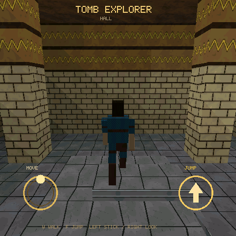

# Tomb Explorer

PS1-style third-person rooms joined by portals, a low-polygon explorer, sector
heights, and a follow camera. The Host RGB565 preview and the device share the
same C model and perspective-correct textured-triangle view. Every texture is generated here; nothing
is taken from a commercial game.

第三人称墓室探索 Demo：传送门房间、扇区高度、跟随相机、11 块盒子角色。Host
RGB565 预览与真机共用同一套 C 模型和透视纹理三角绘制。贴图全部过程生成。

## Play / 玩法

- Touch anywhere on the left half to place a floating stick, then drag to walk.
  Small sideways drift is ignored. / 左半屏落指生成浮动摇杆，拖动移动；轻微横向漂移会被忽略。
- Drag on the right to orbit and tilt the camera. / 右侧拖动环绕和俯仰相机。
- Tap JUMP to jump. / 点跳跃。
- Host keys: `W`/`S` walk, `Q`/`E` strafe, `A`/`D` orbit, `F` jump.

The five rooms are entrance, sloping corridor, hall with a carved frieze,
crypt, and pool.



The screenshot is a Host RGB565 frame of the hall. / 截图为大厅的 Host RGB565 画面。

绘制路径、与 Last Zone / Living Worlds 的对照以及 micropixel 对标见
[`docs/game-drawing-inventory.zh-CN.md`](../../docs/game-drawing-inventory.zh-CN.md)。

五间房间：入口、斜坡走廊、带雕带大厅、墓室、水池。

## Run / 运行

```bash
# Host 仿真：在本仓库根目录
python3 tools/game_cli.py sim examples/tomb_explorer
python3 tools/game_cli.py sim examples/tomb_explorer --headless --frames 8

# 真机：普通 ESP-IDF 工程，不经过 ESP-Iris
export MOSAICO_BSP_COMPONENT_DIR=/path/to/esp-mosaico-bsp/components/esp-mosaico-bsp
idf.py -C examples/tomb_explorer set-target esp32s31 build flash monitor
```
