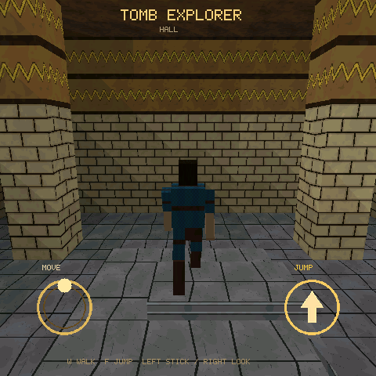

# Tomb Explorer

PS1-style third-person rooms joined by portals, a low-polygon explorer, sector
heights, and a follow camera. The Host RGB565 preview and the device share the
same C model and perspective-correct textured-triangle view. Every texture is generated here; nothing
is taken from a commercial game.

第三人称墓室探索 Demo：传送门房间、扇区高度、跟随相机、11 块盒子角色。Host
RGB565 预览与真机共用同一套 C 模型和透视纹理三角绘制。贴图全部过程生成。

## Play / 玩法

- Touch anywhere on the left half to place a floating stick, then drag to walk.
  Small sideways drift is ignored. / 左半屏落指生成浮动摇杆，拖动移动；轻微横向漂移会被忽略。
- Drag on the right to orbit and tilt the camera. / 右侧拖动环绕和俯仰相机。
- Tap JUMP to jump. / 点跳跃。
- Host keys: `W`/`S` walk, `Q`/`E` strafe, `A`/`D` orbit, `F` jump.

The five rooms are entrance, sloping corridor, hall with a carved frieze,
crypt, and pool.



The screenshot is a Host RGB565 frame of the hall. / 截图为大厅的 Host RGB565 画面。

绘制路径、与 Last Zone / Living Worlds 的对照以及 micropixel 对标见
[`docs/game-drawing-inventory.zh-CN.md`](../../docs/game-drawing-inventory.zh-CN.md)。
当前墙体内核实验与真机数据见
[`../../docs/wall-rendering-optimization-history.zh-CN.md`](../../docs/wall-rendering-optimization-history.zh-CN.md)。

原生震动反馈与声音资产边界见
[`../../docs/native-feedback-history.zh-CN.md`](../../docs/native-feedback-history.zh-CN.md)。

五间房间：入口、斜坡走廊、带雕带大厅、墓室、水池。

## Run / 运行

```bash
# Host 仿真：本仓库根目录，主机 C 编译器 + Pillow
python3 tools/game_cli.py sim examples/tomb_explorer
python3 tools/game_cli.py sim examples/tomb_explorer --headless --frames 8
```

目录根部也是可独立构建的 ESP-IDF native 工程。配置板级组件路径后，
可在本目录运行 `idf.py build`，或用 `idf.py -p PORT flash monitor` 直接烧录；
直接烧录会替换当前启动器固件。板级依赖配置见
[`../../cmake/raylib_lite_native_project.cmake`](../../cmake/raylib_lite_native_project.cmake)。
native 画面上的 FPS 显示实际送屏帧率，首次统计完成前显示 `FPS: --`。

同初始视角的两块板对照（约 25 万像素、28 个三角形、165 个四边形）：
旧 GSP 固件约 31.2 FPS / 30.9 ms 绘制；当前 DMA2D 条带版约 30.3 FPS /
31.6 ms 绘制，条带提交约 25.4 ms，无 CPU 拷贝回退。两者均为逻辑 30 Hz、
渲染目标 50 FPS、游戏循环 CPU1、34 行双缓冲条带；送屏任务优先级 4。
先前约 26.4 FPS 的 DMA2D 结果使用 CPU0 游戏循环、CPU1 送屏任务和 40 行条带，
不能作为同配置的 GSP 对照。纹理绘制使用 `-O3 -funroll-loops`。
